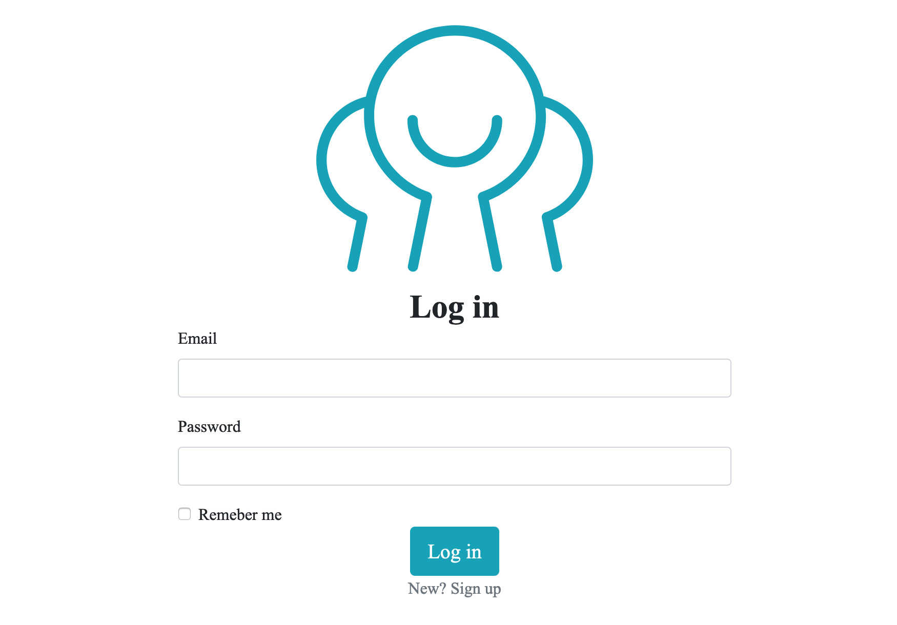
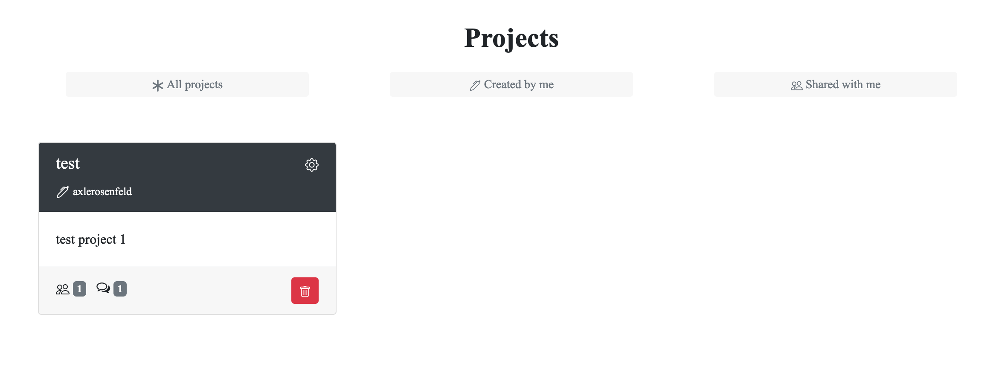
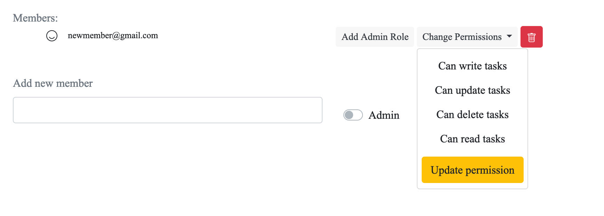
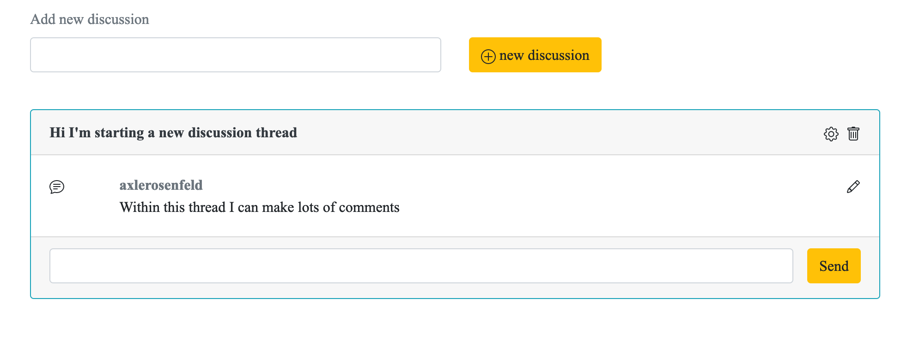
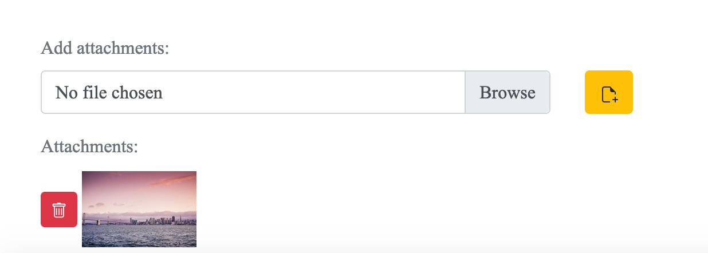
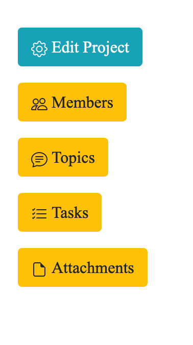

# See It Live: [COLLABORATE](https://stormy-crag-63797.herokuapp.com/)

This is a project management app, with many features of the popular app Basecamp.  I built this app with two other fellows at Qwasar Silicon Valley.  

Features include:
- User authenticated accounts and secure login

- Ability for users to create or participate in multiple projects

- Various permission levels for each user in a project to view/edit

- Discussion threads with topics and sub-topics

- Ability to add attachments (text and image files)

- A todo-list for each project with tasks and sub-tasks - clicking the gear wheel allows you to edit tasks/subtasks

- Anchor links to display different sections of the project page

My specific contributions include:
- Create initial framework of the app and database (with Active Record and Devise gem)
- Allow users to add attachments (Active Storage gem)
- Add user permissions (admin privileges) to the Model and database
- Refactor of Tasks (Model, Controller, Views)
- Update Tasks schema to use a self-join for sub-tasks
- Refactor Javascript for filtering views on front-end
- Migrate database from SQLite to postgreSQL for Heroku deploy
- Numerous bug fixes and minor tweaks to front-end (CSS)

Each member of the team was intimately involved in building our version of Basecamp, and we duplicated much of the functionality in order to learn as much as possible during the process.  For each of us, this was a first experience building a web app using Ruby on Rails.